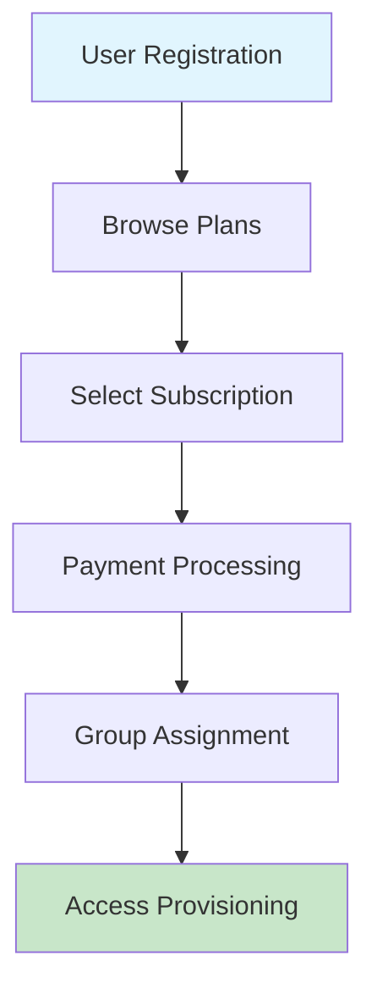
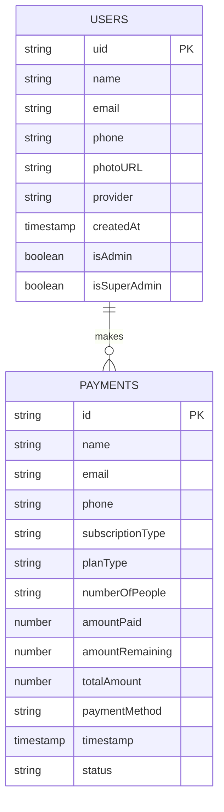
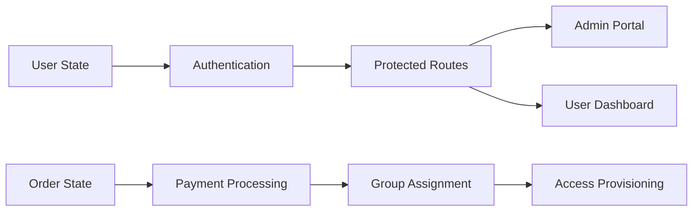

# SplitUp - Subscription Sharing Platform

<div align="center">


**The Smart, Secure Way to Share Subscriptions**

[](https://reactjs.org/)
[](https://firebase.google.com/)
[](https://tailwindcss.com/)
[](https://vitejs.dev/)

*A secure platform proudly incubated at IIIT Delhi*

</div>

---

## 📋 Table of Contents

- [Overview](#overview)
- [Problem Statement](#problem-statement)
- [Solution Architecture](#solution-architecture)
- [Features](#features)
- [Technology Stack](#technology-stack)
- [System Architecture](#system-architecture)
- [Installation & Setup](#installation--setup)
- [Usage](#usage)
- [API Documentation](#api-documentation)
- [Deployment](#deployment)
- [Contributing](#contributing)
- [License](#license)

---

## 🎯 Overview

SplitUp is a comprehensive subscription sharing platform designed to solve the growing problem of expensive individual subscriptions. Our platform enables students and young professionals to share the costs of popular streaming and productivity services while maintaining security and ease of use.

### Key Benefits

- **💰 Cost Savings**: Save up to 83% on subscription costs
- **🔒 Secure Sharing**: Legitimate account sharing with proper access management
- **🤝 Automated Coordination**: No more manual payment collection or reminders
- **📱 User-Friendly**: Intuitive interface for seamless experience
- **📊 Analytics**: Comprehensive tracking and insights

---

## 🚨 Problem Statement

### The Subscription Cost Crisis

In today's digital age, premium subscription services have become essential, but the cumulative cost creates a significant financial burden:

| Service | Individual Cost | Group Cost | Savings |
|---------|----------------|------------|---------|
| Netflix Premium | ₹649/month | ₹139/person | 78% |
| Spotify Family | ₹199/month | ₹34/person | 83% |
| Prime Video | ₹299/month | ₹89/person | 70% |
| Hotstar Premium | ₹299/month | ₹139/person | 53% |

### Target Demographic

- **🎓 College Students**: Living in hostels, sharing expenses
- **👥 Young Professionals**: Roommates or friends sharing living spaces
- **📱 Digital Natives**: Heavy users of streaming services
- **💰 Cost-Conscious Consumers**: Seeking value optimization

---

## 🏗️ Solution Architecture

### Core Concept

SplitUp provides a **secure, automated platform** that enables legitimate subscription sharing through:

1. **Group Formation**: Automated matching of users seeking similar subscriptions
2. **Secure Payments**: Integrated payment processing with transparent cost splitting
3. **Access Management**: Legitimate account sharing with proper user management
4. **Automated Coordination**: Eliminates manual payment collection and reminders

### User Flow



---

## ✨ Features

### 🎯 Core Features

- **📺 Multi-Service Support**: Netflix, Spotify, Prime Video, Hotstar, and more
- **💳 Secure Payment Processing**: Multiple payment methods (UPI, Card, Netbanking)
- **👥 Automated Group Management**: Smart matching and group formation
- **📊 Real-time Analytics**: Comprehensive tracking and insights
- **🔐 Role-based Access**: User, Admin, and Super Admin roles
- **📱 Responsive Design**: Works seamlessly on all devices

### 🛡️ Security Features

- **🔒 Firebase Authentication**: Google OAuth and email/password
- **🔐 Role-based Authorization**: Secure access control
- **💾 Data Encryption**: All data encrypted in transit and at rest
- **🛡️ PCI Compliance**: Secure payment processing
- **📋 GDPR Compliance**: User data protection

### 📈 Admin Features

- **📊 Order Management**: Real-time dashboard for all transactions
- **👥 Group Management**: Automated group formation and member assignment
- **📧 Email Notifications**: Automated communication system
- **📈 Analytics Dashboard**: Revenue tracking and user insights
- **🔍 Search & Filter**: Advanced order management tools

---

## 🛠️ Technology Stack

### Frontend
- **React 18.3.1**: Modern UI framework
- **Vite 6.0.1**: Fast build tool and dev server
- **Tailwind CSS 3.4.16**: Utility-first CSS framework
- **React Router 7.6.2**: Client-side routing
- **React Icons 5.5.0**: Icon library

### Backend
- **Firebase 11.9.1**: Backend-as-a-Service
  - **Authentication**: User management and security
  - **Firestore**: NoSQL database
  - **Hosting**: Static file hosting

### Analytics
- **Google Analytics 4**: User behavior tracking
- **Custom Event Tracking**: Detailed user interaction analytics

### Deployment
- **Vercel**: Global CDN and hosting
- **Environment Variables**: Secure configuration management

---

## 🏛️ System Architecture

### Database Schema



### Component Architecture

```
src/
├── components/
│   ├── Navbar.jsx              # Navigation with auth
│   ├── HeroSection.jsx         # Landing page hero
│   ├── Marquee.jsx             # Testimonials carousel
│   ├── Footer.jsx              # Site footer
│   └── analytics/
│       └── PageTracker.jsx     # Analytics tracking
├── pages/
│   ├── HomePage.jsx            # Landing page
│   ├── Plans.jsx               # Subscription plans
│   ├── Orders.jsx              # User order history
│   ├── AdminPortal.jsx         # Admin dashboard
│   └── auth/
│       └── LoginPage.jsx       # Authentication
└── services/
    ├── firebase/
    │   └── firebase.js         # Firebase configuration
    └── analytics.js            # Analytics service
```

### State Management



---

## 🚀 Installation & Setup

### Prerequisites

- **Node.js** (v16 or higher)
- **npm** or **yarn**
- **Firebase Account**
- **Google Analytics Account**

### Step 1: Clone the Repository

```bash
git clone https://github.com/AbhigyanRaj/SplitUp.git
cd SplitUp
```

### Step 2: Install Dependencies

```bash
npm install
```

### Step 3: Firebase Setup

1. **Create Firebase Project**
   - Go to [Firebase Console](https://console.firebase.google.com/)
   - Create a new project
   - Enable Authentication and Firestore

2. **Configure Firebase**
   ```bash
   # Copy your Firebase config to src/services/firebase/firebase.js
   const firebaseConfig = {
     apiKey: "your-api-key",
     authDomain: "your-project.firebaseapp.com",
     projectId: "your-project-id",
     storageBucket: "your-project.appspot.com",
     messagingSenderId: "your-sender-id",
     appId: "your-app-id"
   };
   ```

### Step 4: Environment Variables

Create a `.env` file in the root directory:

```env
VITE_FIREBASE_API_KEY=your-api-key
VITE_FIREBASE_AUTH_DOMAIN=your-project.firebaseapp.com
VITE_FIREBASE_PROJECT_ID=your-project-id
VITE_FIREBASE_STORAGE_BUCKET=your-project.appspot.com
VITE_FIREBASE_MESSAGING_SENDER_ID=your-sender-id
VITE_FIREBASE_APP_ID=your-app-id
VITE_GA_MEASUREMENT_ID=G-XXXXXXXXXX
```

### Step 5: Google Analytics Setup

1. **Create GA4 Property**
   - Go to [Google Analytics](https://analytics.google.com/)
   - Create a new GA4 property
   - Get your Measurement ID

2. **Update Analytics**
   ```html
   <!-- Update index.html with your Measurement ID -->
   <script async src="https://www.googletagmanager.com/gtag/js?id=G-XXXXXXXXXX"></script>
   ```

### Step 6: Run Development Server

```bash
npm run dev
```

Visit `http://localhost:5173` to see the application.

---

## 📖 Usage

### For Users

1. **Browse Plans**: Visit `/plans` to see available subscriptions
2. **Select Service**: Choose your desired subscription
3. **Complete Payment**: Pay your share securely
4. **Join Group**: Get automatically assigned to a group
5. **Access Service**: Receive credentials and start using

### For Admins

1. **Access Admin Portal**: Login with admin credentials
2. **Manage Orders**: View and update order statuses
3. **Group Management**: Assign users to groups
4. **Analytics**: Monitor platform performance

### Admin Credentials

- **Email**: admin@gmail.com
- **Password**: admin

---

## 🔌 API Documentation

### Authentication Endpoints

```javascript
// Google Sign-in
const handleGoogleSignIn = async () => {
  const result = await signInWithPopup(auth, googleProvider);
  // User automatically created in Firestore
};

// Email/Password Sign-in
const handleEmailAuth = async (email, password) => {
  const userCredential = await signInWithEmailAndPassword(auth, email, password);
};
```

### Firestore Collections

#### Users Collection
```javascript
{
  uid: "string",
  name: "string",
  email: "string",
  phone: "string",
  photoURL: "string",
  provider: "google|password",
  createdAt: "timestamp",
  isAdmin: "boolean",
  isSuperAdmin: "boolean"
}
```

#### Payments Collection
```javascript
{
  id: "string",
  name: "string",
  email: "string",
  phone: "string",
  subscriptionType: "string",
  planType: "string",
  numberOfPeople: "string",
  amountPaid: "number",
  amountRemaining: "number",
  totalAmount: "number",
  paymentMethod: "string",
  timestamp: "timestamp",
  status: "pending|active|completed"
}
```

### Analytics Events

```javascript
// Track page views
analytics.trackPageView('plans_page');

// Track custom events
analytics.trackEvent('subscription_selected', {
  service: 'netflix',
  plan_type: 'premium',
  price: 139
});
```

---

## 🚀 Deployment

### Vercel Deployment

1. **Connect Repository**
   ```bash
   # Install Vercel CLI
   npm i -g vercel
   
   # Deploy
   vercel
   ```

2. **Environment Variables**
   - Add all environment variables in Vercel dashboard
   - Ensure Firebase config is properly set

3. **Custom Domain** (Optional)
   - Configure custom domain in Vercel dashboard
   - Update DNS settings

### Build for Production

```bash
npm run build
```

### Preview Build

```bash
npm run preview
```

---

## 🤝 Contributing

We welcome contributions! Please follow these steps:

1. **Fork the repository**
2. **Create a feature branch**
   ```bash
   git checkout -b feature/amazing-feature
   ```
3. **Make your changes**
4. **Commit your changes**
   ```bash
   git commit -m 'Add amazing feature'
   ```
5. **Push to the branch**
   ```bash
   git push origin feature/amazing-feature
   ```
6. **Open a Pull Request**

### Development Guidelines

- Follow React best practices
- Use TypeScript for new components
- Write comprehensive tests
- Update documentation
- Follow the existing code style

---

## 📄 License

This project is licensed under the MIT License - see the [LICENSE](LICENSE) file for details.

---

## 🙏 Acknowledgments

- **IIIT Delhi**: For incubation and support
- **Firebase**: For backend infrastructure
- **Vercel**: For hosting and deployment
- **React Community**: For the amazing ecosystem

---

## 📞 Contact

- **Website**: [splitup.com](https://splitup.com)
- **Email**: contact@splitup.com
- **GitHub**: [@AbhigyanRaj](https://github.com/AbhigyanRaj)

---

<div align="center">

**Made with ❤️ by SplitUp Team**

*The Smart, Secure Way to Share Subscriptions*

</div>
